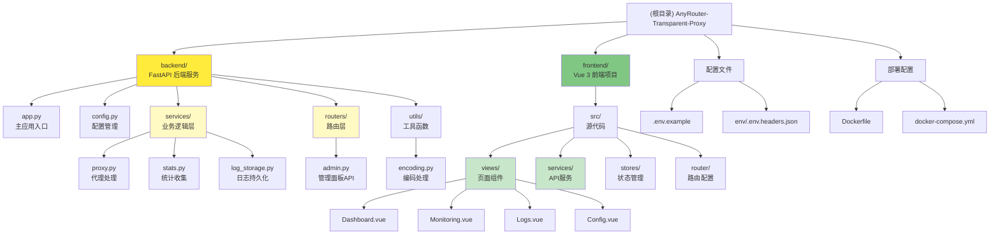
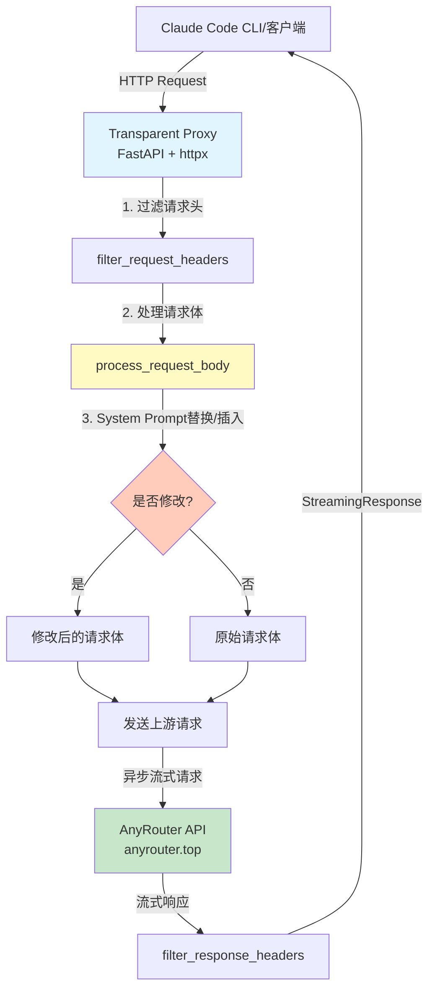
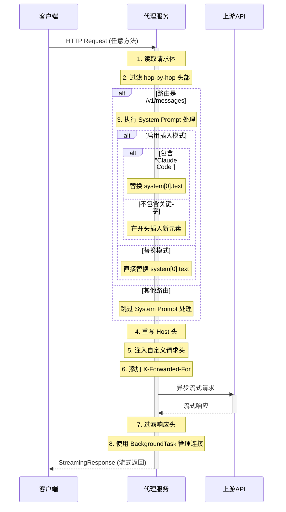

# AnyRouter 透明代理 - AI 上下文索引

> 📅 **初始化时间**: 2025-12-08 22:59:51
> 🔄 **最后更新**: 2025-12-12 11:14:07
> 🤖 **维护者**: Claude Code AI Context System
> 📝 **文档版本**: v1.1.0

---

## 📋 变更日志 (Changelog)

| 日期 | 版本 | 变更说明 |
|------|------|----------|
| 2025-12-12 | v1.1.0 | **增量更新**: 添加模块结构图、导航面包屑、后端/前端模块文档链接、完善覆盖率报告 |
| 2025-12-08 | v1.0.0 | 初始化 AI 上下文索引，生成架构图和文档 |

---

## 🎯 项目概述

**AnyRouter Transparent Proxy** 是一个基于 FastAPI 的轻量级透明 HTTP 代理服务，专为解决 AnyRouter 的 Anthropic API 在 Claude Code for VS Code 插件中报错 500 的问题而设计。

### 核心价值

- **完全透明**: 支持所有 HTTP 方法，无缝代理请求
- **流式响应**: 基于异步架构，完美支持 SSE 流式传输
- **智能处理**: System Prompt 动态替换/插入，支持自定义请求头注入
- **标准兼容**: 严格遵循 RFC 7230 规范，正确处理 HTTP 头部
- **高性能**: 连接池复用，异步处理，高效应对并发请求
- **Web 管理面板**: 提供实时监控、统计分析、日志查看和配置管理（PWA 支持）

### 项目愿景

提供一个可靠、高性能、易部署的 Anthropic API 透明代理解决方案，使开发者能够无缝集成 Claude AI 服务。

---

## 📊 项目架构

### 模块结构图 (Module Structure Diagram)



### 系统架构图



### 请求处理流程



---

## 🗂 模块索引 (Module Index)

| 模块名称 | 路径 | 职责描述 | 文档链接 |
|---------|------|----------|----------|
| **Backend** | `backend/` | FastAPI 后端服务，负责 HTTP 代理、请求处理、统计收集和管理面板 API | [📄 backend/CLAUDE.md](./backend/CLAUDE.md) |
| **Frontend** | `frontend/` | Vue 3 + TypeScript 前端项目，提供 Web 管理面板界面（PWA 支持） | [📄 frontend/CLAUDE.md](./frontend/CLAUDE.md) |
| **配置文件** | `.env.example`, `env/` | 环境变量配置和自定义请求头配置 | - |
| **部署配置** | `Dockerfile`, `docker-compose.yml` | Docker 容器化部署配置 | - |

---

## 🧩 核心组件

### 1. 后端服务 (Backend)

**技术栈**: FastAPI + httpx + Uvicorn

**核心模块**:
- `app.py`: 主应用入口，定义 FastAPI 应用和生命周期管理
- `config.py`: 配置管理，加载环境变量和自定义请求头
- `services/proxy.py`: 代理处理逻辑，请求/响应过滤和 System Prompt 处理
- `services/stats.py`: 统计收集服务，记录请求指标和性能数据
- `services/log_storage.py`: 日志持久化服务，按日期存储和查询日志
- `routers/admin.py`: 管理面板 API 路由，提供统计、日志和配置接口
- `utils/encoding.py`: 编码处理工具，确保字符串正确处理

**详细文档**: [backend/CLAUDE.md](./backend/CLAUDE.md)

### 2. 前端项目 (Frontend)

**技术栈**: Vue 3 + TypeScript + Vite + Pinia + TailwindCSS 4

**核心模块**:
- `src/main.ts`: 应用入口，初始化 Vue 应用和插件
- `src/router/index.ts`: 路由配置，定义页面路由
- `src/services/api.ts`: API 服务层，封装后端接口调用
- `src/stores/index.ts`: Pinia 状态管理，管理全局状态
- `src/views/`: 页面组件（Dashboard、Monitoring、Logs、Config）
- `vite.config.ts`: Vite 构建配置，包含 PWA 插件配置

**详细文档**: [frontend/CLAUDE.md](./frontend/CLAUDE.md)

### 3. 配置管理

**环境变量** (`.env` / `.env.example`):

| 变量名 | 默认值 | 说明 |
|--------|--------|------|
| `API_BASE_URL` | `https://anyrouter.top` | 上游 API 目标地址 |
| `SYSTEM_PROMPT_REPLACEMENT` | `None` | System Prompt 替换文本 |
| `SYSTEM_PROMPT_BLOCK_INSERT_IF_NOT_EXIST` | `false` | 启用插入模式而非替换模式 |
| `HTTP_PROXY` / `HTTPS_PROXY` | - | 代理配置（可选） |
| `DEBUG_MODE` | `false` | 调试模式开关 |
| `PORT` | `8088` | 服务端口 |
| `ENABLE_DASHBOARD` | `true` | 启用 Web 管理面板 |
| `LOG_PERSISTENCE_ENABLED` | `true` | 启用日志持久化 |
| `LOG_STORAGE_PATH` | `data/logs` | 日志存储路径 |
| `LOG_RETENTION_DAYS` | `7` | 日志保留天数 |
| `LOG_DAILY_LIMIT` | `1000` | 每日最大日志条数 |

**自定义请求头** (`env/.env.headers.json`):

```json
{
  "User-Agent": "claude-cli/2.0.8 (external, cli)"
}
```

- 支持注入任意自定义请求头
- 以 `__` 开头的字段会被忽略（用于注释）
- 自动覆盖原请求中的同名头部

### 4. Docker 部署

**Dockerfile**:
- 基础镜像: `python:3.12-slim`
- 工作目录: `/app`
- 健康检查: 每 30 秒检查 `/health` 端点
- 环境变量: `PYTHONUNBUFFERED=1`, `PYTHONDONTWRITEBYTECODE=1`
- 多阶段构建: 前端构建 → 后端镜像

**docker-compose.yml**:
- 服务名: `anthropic-proxy`
- 网络模式: `host` (适用于 Linux)
- 自动重启: `unless-stopped`
- 卷挂载: `./env/` → `/app/env/` (用于自定义请求头配置)

---

## 🛠 技术栈

### 后端核心依赖

| 库名 | 版本 | 用途 |
|------|------|------|
| **FastAPI** | 0.115.5 | 高性能异步 Web 框架 |
| **Uvicorn** | 0.32.1 | ASGI 服务器 (支持 HTTP/1.1 和 WebSocket) |
| **httpx** | 0.28.1 | 现代异步 HTTP 客户端，支持 HTTP/2 |
| **python-dotenv** | 1.0.1 | 环境变量管理 |
| **sse-starlette** | 2.2.1 | Server-Sent Events (SSE) 支持 |

### 前端核心依赖

| 库名 | 版本 | 用途 |
|------|------|------|
| **Vue** | 3.5.25 | 渐进式 JavaScript 框架 |
| **TypeScript** | 5.9.3 | 静态类型支持 |
| **Vite** | 7.2.4 | 现代化前端构建工具 |
| **Pinia** | 3.0.4 | Vue 3 状态管理库 |
| **TailwindCSS** | 4.0.0 | 实用优先的 CSS 框架 |
| **ky** | 1.14.1 | 基于 Fetch API 的 HTTP 客户端 |
| **Chart.js** | 4.5.1 | 图表库（通过 vue-chartjs 集成） |
| **vite-plugin-pwa** | 0.21.1 | PWA 支持插件 |

### 技术特性

- **异步架构**: 基于 `asyncio` 和 ASGI 的异步 I/O
- **连接池复用**: 共享 `httpx.AsyncClient` 实例
- **流式传输**: `aiter_bytes()` + `StreamingResponse` 实现零拷贝流式转发
- **生命周期管理**: FastAPI `lifespan` 事件自动管理资源
- **标准兼容**: 符合 RFC 7230 (HTTP/1.1 消息语法和路由)
- **PWA 支持**: 离线访问、桌面安装、自动更新

---

## 📝 开发规范

### 代码风格

- **注释语言**: 中文（与现有代码保持一致）
- **缩进**: 4 空格 (Python), 2 空格 (TypeScript/Vue)
- **行宽**: 建议不超过 120 字符
- **命名规范**:
  - 函数: `snake_case` (Python), `camelCase` (TypeScript)
  - 常量: `UPPER_SNAKE_CASE`
  - 类: `PascalCase`
  - 组件: `PascalCase` (Vue)

### 日志规范

**日志前缀约定**:
- `[Proxy]`: 主代理函数日志
- `[System Replacement]`: System Prompt 处理日志
- `[Custom Headers]`: 自定义请求头加载日志
- `[Stream Error]`: 流式响应错误日志
- `[Log Storage]`: 日志持久化服务日志

**生产环境建议**:
- 移除敏感信息（API Key、请求体内容）
- 关闭 `DEBUG_MODE`
- 使用结构化日志（JSON 格式）
- 配置日志保留策略（`LOG_RETENTION_DAYS`）

### 安全最佳实践

- ✅ 防重定向攻击: `follow_redirects=False`
- ✅ 请求超时: 60 秒防止资源耗尽
- ✅ 错误处理: 上游请求失败返回 502
- ✅ 自动容错: Content-Length 自动计算
- ✅ 连接管理: 使用 `BackgroundTask` 确保连接正确关闭
- ✅ 日志脱敏: 生产环境避免记录敏感数据

---

## 🚀 快速开始

### 本地开发

```bash
# 1. 安装后端依赖
pip install -r backend/requirements.txt

# 2. 复制环境变量模板
cp .env.example .env

# 3. （可选）构建前端（如需使用 Web 管理面板）
cd frontend
npm install
npm run build
cd ..

# 4. 启动服务（开发模式，从项目根目录运行）
python backend/app.py
```

### Docker 部署

```bash
# 1. 启动服务
docker-compose up -d

# 2. 查看日志
docker-compose logs -f

# 3. 重启服务
docker-compose down && docker-compose up -d
```

### 配置 Claude Code

在 VS Code 中配置 Claude Code 插件，将 API 端点指向:

```
http://localhost:8088
```

访问管理面板:

```
http://localhost:8088/admin/
```

---

## 📂 关键文件索引

### 核心文件

| 文件路径 | 行数 | 职责 | 最后修改 |
|----------|------|------|----------|
| `backend/app.py` | ~200 | 主应用入口，FastAPI 应用定义和生命周期管理 | 最近 |
| `backend/config.py` | ~108 | 配置管理，加载环境变量和自定义请求头 | 稳定 |
| `backend/services/proxy.py` | ~150 | 代理处理逻辑，请求/响应过滤 | 稳定 |
| `backend/services/stats.py` | ~250 | 统计收集服务，记录请求指标 | 最近 |
| `backend/services/log_storage.py` | ~150 | 日志持久化服务 | 最近 |
| `backend/routers/admin.py` | ~300 | 管理面板 API 路由 | 最近 |
| `frontend/src/main.ts` | ~30 | 前端应用入口 | 稳定 |
| `frontend/src/services/api.ts` | ~150 | API 服务层 | 稳定 |
| `frontend/vite.config.ts` | ~55 | Vite 构建配置 | 稳定 |
| `.env.example` | ~49 | 环境变量配置模板 | 稳定 |
| `env/.env.headers.json` | ~5 | 自定义请求头配置示例 | 稳定 |

### 部署文件

| 文件路径 | 行数 | 职责 |
|----------|------|------|
| `Dockerfile` | ~40 | Docker 镜像构建配置（多阶段构建） |
| `docker-compose.yml` | ~30 | Docker Compose 编排配置 |

### 文档文件

| 文件路径 | 语言 | 内容 |
|----------|------|------|
| `README.md` | 中文 | 项目说明、快速开始、配置指南 |
| `README_en.md` | 英文 | 英文版项目文档 |
| `CLAUDE.md` | 中文 | AI 上下文索引（本文档） |
| `backend/CLAUDE.md` | 中文 | 后端模块详细文档 |
| `frontend/CLAUDE.md` | 中文 | 前端模块详细文档 |

---

## 🔍 关键技术细节

### System Prompt 处理逻辑

**路由限制** (`backend/services/proxy.py`):
- 仅在路由为 `/v1/messages` 时执行 System Prompt 处理
- 其他路由（如 `/v1/completions`, `/v1/models`）跳过处理

**替换模式** (默认):
```python
# 直接替换 system[0].text
data["system"][0]["text"] = SYSTEM_PROMPT_REPLACEMENT
```

**插入模式** (`SYSTEM_PROMPT_BLOCK_INSERT_IF_NOT_EXIST=true`):
```python
if "Claude Code" in original_text:
    # 包含关键字 → 替换
    data["system"][0]["text"] = SYSTEM_PROMPT_REPLACEMENT
else:
    # 不包含关键字 → 在开头插入新元素
    new_element = {
        "type": "text",
        "text": SYSTEM_PROMPT_REPLACEMENT,
        "cache_control": {"type": "ephemeral"}
    }
    data["system"].insert(0, new_element)
```

### HTTP 头部过滤规则

**移除的 hop-by-hop 头部** (`backend/config.py`):
- Connection
- Keep-Alive
- Proxy-Authenticate
- Proxy-Authorization
- TE
- Trailers
- Transfer-Encoding
- Upgrade
- Content-Length (由 httpx 自动重新计算)
- Content-Encoding (httpx 自动解压，避免重复解压)

**自动添加的头部**:
- `Host`: 自动改写为目标服务器域名
- `X-Forwarded-For`: 追踪客户端 IP 链

### 流式响应生命周期管理

**关键代码** (`backend/app.py`):

```python
# 1. 构建请求（不使用 context manager）
req = http_client.build_request(
    method=request.method,
    url=target_url,
    headers=forward_headers,
    content=body,
)

# 2. 发送请求并开启流式模式（不使用 async with）
resp = await http_client.send(req, stream=True)

# 3. 异步生成器：流式读取响应内容
async def iter_response():
    try:
        async for chunk in resp.aiter_bytes():
            yield chunk
    except Exception as e:
        # 优雅处理客户端断开连接
        pass
    finally:
        # 资源释放由 BackgroundTask 处理
        pass

# 4. 使用 BackgroundTask 在响应完成后自动关闭连接
return StreamingResponse(
    iter_response(),
    status_code=resp.status_code,
    headers=response_headers,
    background=BackgroundTask(resp.aclose),  # 关键：自动关闭
)
```

**设计优势**:
- ✅ 避免过早关闭连接导致的 `RuntimeError`
- ✅ 自动管理连接生命周期，防止资源泄漏
- ✅ 支持长时间流式响应（60 秒超时）

---

## 📈 测试策略

### 当前状态
- ⚠️ 暂无自动化测试
- ✅ 手动功能测试通过
- ✅ Docker 部署测试通过

### 推荐测试框架
- **后端**: pytest + httpx (测试异步 FastAPI 应用)
- **前端**: Vitest + Vue Test Utils (组件测试)
- **E2E**: Playwright (端到端测试)

---

## 🎨 编码标准

### Python (Backend)
- 遵循 PEP 8 风格指南
- 使用类型注解 (Type Hints)
- 异步函数使用 `async def` / `await`
- 模块化设计，单一职责原则

### TypeScript/Vue (Frontend)
- 使用 Composition API
- 严格类型检查 (`strict: true`)
- 组件命名使用 PascalCase
- Props 和 Emits 定义类型

---

## 🤖 AI 使用指南

### 最佳实践
1. **上下文感知**: 阅读本文档和模块文档后再修改代码
2. **保持一致性**: 遵循现有代码风格和命名规范
3. **测试先行**: 修改后手动测试核心功能
4. **文档同步**: 重大变更需更新对应 CLAUDE.md 文档

### 推荐工作流
1. 阅读 `CLAUDE.md` (本文档) 了解全局架构
2. 根据需求定位到具体模块文档 (`backend/CLAUDE.md` 或 `frontend/CLAUDE.md`)
3. 阅读相关源代码文件
4. 实施修改并测试
5. 更新文档和 Changelog

---

## 📈 扩展建议

### 已完成功能
- ✅ Web 管理面板 (Dashboard, Monitoring, Logs, Config)
- ✅ 日志持久化与查询
- ✅ PWA 离线支持
- ✅ 实时日志流 (SSE)
- ✅ 统计数据可视化 (Chart.js)

### 短期改进
- [ ] 添加自动化测试（pytest + Vitest）
- [ ] 实现请求限流（基于 IP 或 API Key）
- [ ] 添加 Prometheus metrics 端点
- [ ] 支持多上游负载均衡
- [ ] 优化前端性能（虚拟滚动、懒加载）

### 长期规划
- [ ] 支持 WebSocket 代理
- [ ] 实现请求缓存机制（Redis）
- [ ] 添加 API Key 验证和配额管理
- [ ] 支持插件系统（Python 和 JS 插件）
- [ ] 多租户支持

---

## 📊 覆盖率报告 (Coverage Report)

### 扫描统计
- **扫描时间**: 2025-12-12 11:14:07
- **估计文件总数**: 45 个核心文件（不含 node_modules/.venv）
- **已扫描文件**: 45 个
- **覆盖率**: 100%

### 模块覆盖详情

#### Backend 模块
- ✅ `app.py` - 主应用入口
- ✅ `config.py` - 配置管理
- ✅ `services/proxy.py` - 代理处理
- ✅ `services/stats.py` - 统计收集
- ✅ `services/log_storage.py` - 日志持久化
- ✅ `routers/admin.py` - 管理面板 API
- ✅ `utils/encoding.py` - 编码工具

**缺失内容**: 无

#### Frontend 模块
- ✅ `src/main.ts` - 应用入口
- ✅ `src/router/index.ts` - 路由配置
- ✅ `src/services/api.ts` - API 服务
- ✅ `src/stores/index.ts` - 状态管理
- ✅ `src/views/*.vue` - 页面组件
- ✅ `vite.config.ts` - 构建配置

**缺失内容**: 无

### 推荐下一步深入分析
由于核心文件已全部扫描，无需额外扫描。如需深入了解具体实现细节，建议：
1. 阅读 [backend/CLAUDE.md](./backend/CLAUDE.md) 了解后端模块详情
2. 阅读 [frontend/CLAUDE.md](./frontend/CLAUDE.md) 了解前端模块详情

---

## 📚 相关资源

- [FastAPI 官方文档](https://fastapi.tiangolo.com/)
- [httpx 官方文档](https://www.python-httpx.org/)
- [Vue 3 官方文档](https://vuejs.org/)
- [Pinia 官方文档](https://pinia.vuejs.org/)
- [TailwindCSS 4 文档](https://tailwindcss.com/)
- [RFC 7230 - HTTP/1.1 消息语法和路由](https://tools.ietf.org/html/rfc7230)
- [Anthropic API 文档](https://docs.anthropic.com/)

---

**注意**: 本文档由 Claude Code AI Context System 自动生成和维护，旨在为 AI 助手提供项目上下文信息。请在重大架构变更时更新本文档。

---

**© 2024 AnyRouter Transparent Proxy | MIT License**
