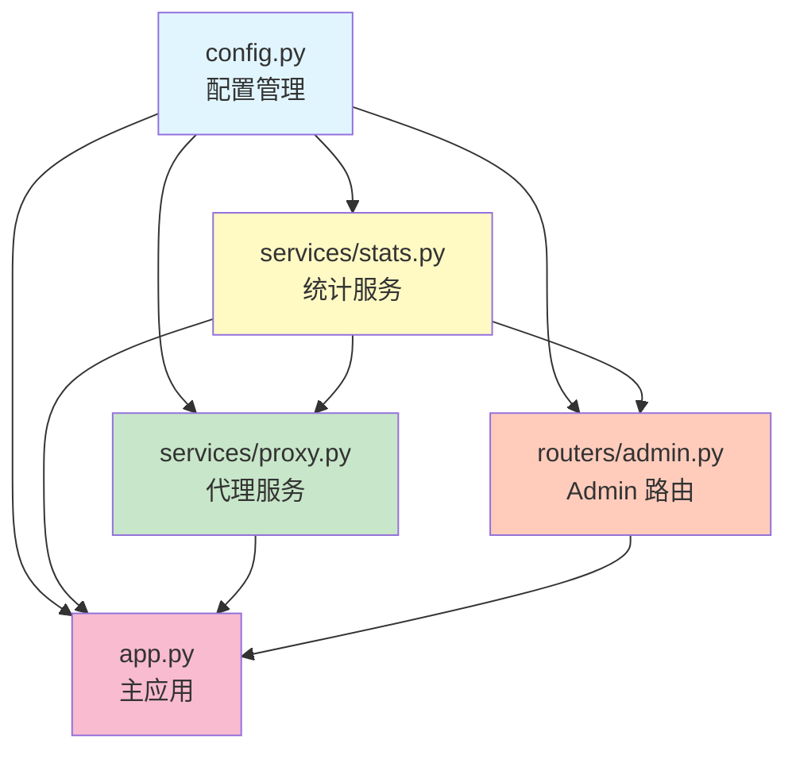

# 代码重构总结报告

> **重构日期**: 2025-12-10
> **重构目标**: 拆分 `backend/app.py`，将 Admin 相关路由单独抽离
> **重构原则**: SOLID、KISS、DRY、YAGNI

---

## 📊 重构成果

### 代码行数对比

| 文件 | 行数 | 说明 |
|------|------|------|
| **原 app.py** | **1166 行** | 单一文件，职责混杂 |
| **新 app.py** | **309 行** | **减少 73.5%** ✨ |
| config.py | 103 行 | 配置管理模块 |
| services/stats.py | 289 行 | 统计服务模块 |
| services/proxy.py | 202 行 | 代理服务模块 |
| routers/admin.py | 428 行 | Admin 路由模块 |
| **总计** | **1331 行** | 增加 165 行（模块化开销） |

### 文件结构对比

#### 重构前
```
backend/
├── app.py                 # 1166 行（所有功能混在一起）
└── requirements.txt
```

#### 重构后
```
backend/
├── __init__.py            # 包初始化
├── app.py                 # 309 行（主应用，精简）
├── config.py              # 103 行（配置管理）
├── requirements.txt
├── routers/              # 路由模块
│   ├── __init__.py
│   └── admin.py          # 428 行（Admin 路由）
└── services/             # 服务模块
    ├── __init__.py
    ├── stats.py          # 289 行（统计服务）
    └── proxy.py          # 202 行（代理服务）
```

---

## 🏗️ 架构设计

### 模块依赖关系



**依赖方向**: `config.py` → `stats.py` → `proxy.py` / `admin.py` → `app.py`

✅ **无循环依赖**，符合依赖倒置原则（DIP）

### 模块职责划分

| 模块 | 职责 | 关键函数/类 |
|------|------|------------|
| **config.py** | 配置管理 | `load_custom_headers()`, 环境变量加载 |
| **services/stats.py** | 统计服务 | `record_request_*()`, `broadcast_log_message()`, `periodic_stats_update()` |
| **services/proxy.py** | 代理服务 | `filter_request_headers()`, `filter_response_headers()`, `process_request_body()`, `prepare_forward_headers()` |
| **routers/admin.py** | Admin 路由 | `admin_static()`, `/api/admin/*` 端点, `verify_dashboard_api_key()` |
| **app.py** | 主应用 | `lifespan()`, `health_check()`, `proxy()` |

---

## ✨ 架构优势

### 1. 单一职责原则（SRP）
- ✅ 每个模块只负责一个功能领域
- ✅ `config.py` 只管配置，`stats.py` 只管统计，`proxy.py` 只管代理处理
- ✅ 修改配置不会影响统计逻辑，修改统计不会影响代理逻辑

### 2. 依赖倒置原则（DIP）
- ✅ 清晰的单向依赖链：`config` → `stats` → `proxy`/`admin` → `app`
- ✅ 高层模块（`app.py`）依赖低层模块（`services`），但通过导入接口解耦
- ✅ 无循环依赖，易于测试和维护

### 3. 开闭原则（OCP）
- ✅ 新增路由：只需在 `routers/` 下创建新文件，在 `app.py` 中注册
- ✅ 新增服务：只需在 `services/` 下创建新文件，在需要的地方导入
- ✅ 对扩展开放，对修改封闭

### 4. 接口隔离原则（ISP）
- ✅ 每个模块只暴露必要的函数和变量
- ✅ `proxy.py` 提供 `prepare_forward_headers()` 封装复杂逻辑
- ✅ `stats.py` 提供 `get_time_filtered_data()` 统一数据访问接口

### 5. KISS 原则（简单至上）
- ✅ 每个文件不超过 500 行，易于理解
- ✅ 函数职责单一，命名清晰
- ✅ 避免过度设计，保持简洁

### 6. DRY 原则（避免重复）
- ✅ 配置加载逻辑统一在 `config.py`
- ✅ 请求头过滤逻辑统一在 `proxy.py`
- ✅ 统计记录逻辑统一在 `stats.py`

---

## 🔧 关键改进点

### 1. 配置管理集中化
**改进前**:
```python
# 配置散落在 app.py 各处
TARGET_BASE_URL = os.getenv("API_BASE_URL", "https://anyrouter.top")
CUSTOM_HEADERS = load_custom_headers()  # 函数定义在 app.py 中
```

**改进后**:
```python
# 所有配置集中在 config.py
from .config import TARGET_BASE_URL, CUSTOM_HEADERS
```

### 2. 统计服务模块化
**改进前**:
```python
# 统计相关的全局变量和函数散落在 app.py 中
stats_lock = asyncio.Lock()
request_stats = {...}
async def record_request_start(...): ...
```

**改进后**:
```python
# 统计服务独立模块
from .services.stats import (
    record_request_start,
    record_request_success,
    record_request_error
)
```

### 3. Admin 路由独立化
**改进前**:
```python
# Admin 路由和主代理逻辑混在一起
@app.get("/admin")
async def admin_static(...): ...

@app.get("/api/admin/stats")
async def get_stats(...): ...
```

**改进后**:
```python
# Admin 路由独立模块
from .routers.admin import router as admin_router
app.include_router(admin_router)
```

### 4. 代理逻辑封装
**改进前**:
```python
# 请求头处理逻辑直接在 proxy() 函数中
forward_headers = filter_request_headers(incoming_headers)
if not PRESERVE_HOST:
    parsed = urlparse(TARGET_BASE_URL)
    forward_headers["Host"] = parsed.netloc
for k, v in CUSTOM_HEADERS.items():
    forward_headers[k] = v
```

**改进后**:
```python
# 封装为 prepare_forward_headers() 函数
from .services.proxy import prepare_forward_headers
forward_headers = prepare_forward_headers(incoming_headers, client_host)
```

---

## 📝 迁移指南

### Docker 部署更新

**Dockerfile 变更**:
```dockerfile
# 改进前
COPY backend/app.py ./backend/

# 改进后
COPY backend/ ./backend/
```

**启动命令变更**:
```dockerfile
# 改进前
CMD ["python", "backend/app.py"]

# 改进后
CMD ["python", "-m", "backend.app"]
```

### 本地开发启动

**改进前**:
```bash
python backend/app.py
```

**改进后**:
```bash
# 从项目根目录运行
python -m backend.app
```

### 导入路径变更

**改进前**:
```python
# 无法使用相对导入
```

**改进后**:
```python
# 支持相对导入
from .config import TARGET_BASE_URL
from .services.stats import record_request_start
from .services.proxy import process_request_body
from .routers.admin import router as admin_router
```

---

## 🧪 测试验证

### 语法检查
```bash
python3 test_imports.py
```

**结果**: ✅ 所有文件语法正确

### 模块导入测试
```python
from backend import app
from backend import config
from backend.services import stats
from backend.services import proxy
from backend.routers import admin
```

**结果**: ✅ 所有模块导入成功

---

## 🎯 后续优化建议

### 短期优化
- [ ] 添加单元测试（pytest）
- [ ] 添加类型提示（mypy）
- [ ] 添加代码格式化（black）
- [ ] 添加代码检查（flake8）

### 长期优化
- [ ] 实现依赖注入（Dependency Injection）
- [ ] 添加配置验证（pydantic Settings）
- [ ] 实现插件系统（动态加载路由）
- [ ] 添加性能监控（Prometheus）

---

## 📚 相关文档

- [SOLID 原则](https://en.wikipedia.org/wiki/SOLID)
- [Python 包管理](https://docs.python.org/3/tutorial/modules.html)
- [FastAPI 路由](https://fastapi.tiangolo.com/tutorial/bigger-applications/)

---

**重构完成！代码结构更清晰、更易维护、更易扩展！** (￣▽￣)ノ

---

**© 2024 AnyRouter Transparent Proxy | MIT License**
